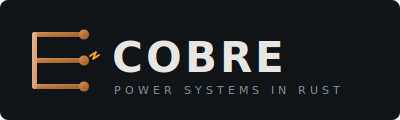

<p align="center">
  
</p>

<p align="center">
  <strong>Open infrastructure for power system computation</strong>
</p>

<p align="center">
  <a href="https://github.com/cobre-rs/cobre/actions/workflows/ci.yml"></a>
  <a href="https://codecov.io/gh/cobre-rs/cobre"></a>
  <a href="https://crates.io/crates/cobre"></a>
  <a href="https://pypi.org/project/cobre-python/"></a>
  <a href="https://pypi.org/project/cobre-python/"></a>
  <a href="https://docs.rs/cobre"></a>
  <a href="https://github.com/cobre-rs/cobre/blob/main/LICENSE"></a>
</p>

---

**Cobre** is an open-source ecosystem of Rust crates for power system analysis and optimization. It provides a shared data model, file format interoperability, stochastic scenario generation, and a distributed SDDP solver for hydrothermal dispatch — with interfaces for CLI, Python, and AI agents.

The name comes from the Portuguese word for **copper** — the metal that conducts electricity.

> **Software Book:** [cobre-rs.github.io/cobre](https://cobre-rs.github.io/cobre/) |
> **Methodology:** [cobre-rs.github.io/cobre-docs](https://cobre-rs.github.io/cobre-docs/)

## Why Cobre?

Power system computation today is split between closed-source commercial tools and fragmented academic projects. Cobre aims to provide:

- **A shared data model** — the same `HydroPlant`, `Bus`, or `ThermalUnit` type works whether you're running a 10-year stochastic dispatch or inspecting results from Python. Define your system once, analyze it from multiple angles.
- **Production performance** — Rust gives C/C++-level speed with memory safety. For software that dispatches national power grids, both matter.
- **Reproducibility** — declaration-order invariance guarantees bit-for-bit identical results regardless of input entity ordering.
- **Modularity** — pick the crates you need. Use `cobre-core` for data modeling without pulling in solver dependencies. Use `cobre-sddp` without caring about interfaces.
- **Interoperability** — JSON/Parquet input, MCP server for AI agents, Python bindings for Jupyter workflows.

## Crates

| Crate                                          | Status                                                                                     | Description                                                                                                            |
| ---------------------------------------------- | ------------------------------------------------------------------------------------------ | ---------------------------------------------------------------------------------------------------------------------- |
| [`cobre-core`](crates/cobre-core/)             |                | Power system entity model — buses, hydros, thermals, lines, pumping stations, contracts                                |
| [`cobre-io`](crates/cobre-io/)                 |                | Input loading (JSON/Parquet), output writing (Parquet/FlatBuffers), 5-layer validation pipeline                        |
| [`cobre-stochastic`](crates/cobre-stochastic/) |                | PAR(p) inflow models, PAR(p) fitting, stochastic load noise, correlated scenario generation, opening tree construction |
| [`cobre-solver`](crates/cobre-solver/)         |                | LP solver abstraction with HiGHS backend, zero-copy solution views, warm-start basis management                        |
| [`cobre-comm`](crates/cobre-comm/)             |                | Pluggable communication abstraction — MPI, TCP, shared-memory, and local backends                                      |
| [`cobre-sddp`](crates/cobre-sddp/)             |                | Stochastic Dual Dynamic Programming — training loop, forward/backward pass, cut management, estimation pipeline        |
| [`cobre-cli`](crates/cobre-cli/)               |                | Command-line interface: `init`, `run`, `validate`, `report`, `summary`, `version`                                      |
| [`cobre-python`](crates/cobre-python/)         |  | PyO3 bindings — case loading, validation, training, simulation, result inspection                                      |

**Related:**

| Repository                                             | Description                                                    |
| ------------------------------------------------------ | -------------------------------------------------------------- |
| [`ferrompi`](https://github.com/cobre-rs/ferrompi)     | MPI 4.x safe Rust bindings — optional backend for `cobre-comm` |
| [`cobre-docs`](https://github.com/cobre-rs/cobre-docs) | Methodology reference and full specification corpus (mdBook)   |

> Status badges use the [Cobre brand palette](docs/BRAND-GUIDELINES.md):    

## Architecture

The ecosystem is organized in five layers. `cobre-core` is the shared foundation — every other crate depends on it and nothing in the lower layers knows about SDDP.

```
┌──────────────────────────────────────────────────────────────────┐
│                     Application Layer                            │
│  ┌───────────┐                                                   │
│  │ cobre-cli │                                                   │
│  └─────┬─────┘                                                   │
├────────┼─────────────────────────────────────────────────────────┤
│        │        Solver Vertical                                  │
│  ┌─────┴────────────────────────────────────────────┐            │
│  │                      cobre-sddp                  │            │
│  │     Training loop · Simulation · Cut management  │            │
│  └────┬────────────────────────────────┬────────────┘            │
├───────┼────────────────────────────────┼─────────────────────────┤
│       │        Infrastructure          │                         │
│  ┌────┴──────┐  ┌───────────┐  ┌───────┴──────┐  ┌──────────┐    │
│  │cobre-     │  │cobre-     │  │cobre-        │  │cobre-    │    │
│  │stochastic │  │solver     │  │comm          │  │io        │    │
│  │PAR(p) ·   │  │HiGHS ·    │  │MPI · TCP ·   │  │JSON ·    │    │
│  │scenarios  │  │LP/warm-   │  │shm · local   │  │Parquet · │    │
│  │           │  │start      │  │              │  │FlatBufs  │    │
│  └────┬──────┘  └─────┬─────┘  └──────┬───────┘  └────┬─────┘    │
├───────┴───────────────┴───────────────┴───────────────┴──────────┤
│                       Foundation Layer                           │
│  ┌──────────────────────────────────────────────────────────┐    │
│  │                       cobre-core                         │    │
│  │  Buses · Hydros · Thermals · Lines · Pumping · Contracts │    │
│  └──────────────────────────────────────────────────────────┘    │
├──────────────────────────────────────────────────────────────────┤
│            Optional: ferrompi (MPI 4.x Rust bindings)            │
└──────────────────────────────────────────────────────────────────┘
```

Key design decisions:

- **`cobre-core` has zero solver dependencies** — a pure data and validation crate
- **Static dispatch** — generics over solver and communicator traits eliminate vtable overhead
- **Declaration-order invariance** — entity collections are sorted by ID; results are reproducible regardless of input file ordering

## Quick Start

<p align="center">
  
</p>

> **Warning:** Cobre v0.1 is alpha software. The API and case format are not stable yet.

```bash
# Install (requires Rust 1.85+ and HiGHS)
cargo install cobre-cli

# Scaffold the 1dtoy example
cobre init --template 1dtoy my-study/

# Run training + simulation
cobre run my-study/

# Inspect results
cobre report my-study/output/

# Print summary statistics
cobre summary my-study/output/
```

A case directory follows a JSON + Parquet layout:

```
case/
├── config.json          # Algorithm configuration (solver, iterations, risk measure…)
├── stages.json          # Stage definitions and policy graph
├── system/              # Entity registries (buses.json, hydros.json, thermals.json…)
├── scenarios/           # Stochastic data (PAR coefficients, correlation — Parquet)
│   ├── inflow_history.parquet   # (optional) Historical inflow series for PAR fitting
│   └── load_factors.parquet     # (optional) Load factor time series
└── constraints/         # Initial conditions and generic constraints (JSON)
```

See the [software book](https://cobre-rs.github.io/cobre/) for the complete input/output specification and user guide.

## Context

Cobre was born from the need for an open, modern alternative for enabling power system planning research in Brazil. While those tools are mature and production-proven, they present challenges in auditability, extensibility, and integration with modern computational infrastructure.

The project draws inspiration from:

- **NREL Sienna** (Julia) — ecosystem architecture with shared data model
- **PowSyBl** (Java) — modular design, institutional adoption path
- **SDDP.jl** (Julia) — algorithmic reference for SDDP implementation
- **SPARHTACUS** (C++) — auditable pre-processing approach

Cobre is not a replacement for these tools — it's a new entry in the ecosystem, offering the Rust community's strengths (safety, performance, modern tooling) to a domain that can benefit from them.

## Roadmap

The minimal viable solver is built through an [8-phase implementation sequence](https://cobre-rs.github.io/cobre-docs/specs/overview/implementation-ordering.html) defined in cobre-docs. Each phase produces a testable intermediate.

### v0.1 — Minimal Viable SDDP Solver

**Complete.** 8 implementation phases covering the full training→simulation→output pipeline. 2,179 tests.

### v0.1.1 — Stochastic Foundation

**Complete.** PAR model fitting from inflow history (Levinson-Durbin, AIC order selection), inflow truncation, stochastic load demand, estimation pipeline, `cobre summary` subcommand, load validation rules.

### v0.1.2 — Code Quality and Documentation

**In progress.** Abstraction cleanup (generic PAR evaluation aliases), documentation accuracy fixes, multi-rank reproducibility validation, and design ADRs for upcoming features (opening tree, stochastic export, complete tree work distribution, per-stage warm-start cuts).

### v0.2 — Production Hardening

- [x] FPHA hydroelectric production function
- [ ] `cobre-python` — PyO3 bindings with NumPy/Arrow zero-copy paths
- [ ] `cobre-tui` — ratatui convergence monitor, co-hosted and pipe modes
- [ ] `cobre-mcp` — MCP server for AI agent integration (stdio + HTTP/SSE)
- [ ] Benchmark suite with published results
- [ ] Comparison study against reference implementations on public test cases

## Contributing

Contributions are welcome. See [CONTRIBUTING.md](CONTRIBUTING.md) for guidelines.

The project follows [Conventional Commits](https://www.conventionalcommits.org/):

```
feat(sddp): implement multi-cut strategy
fix(core): correct reservoir volume bounds validation
docs(io): document Parquet schema for hydro inflows
```

## License

Cobre is licensed under the [Apache License, Version 2.0](LICENSE).

## Citation

If you use Cobre in academic work, please cite:

```bibtex
@software{cobre,
  author = {Alves, Rogerio J. M.},
  title = {Cobre: Open Infrastructure for Power System Computation},
  url = {https://github.com/cobre-rs/cobre},
  license = {Apache-2.0}
}
```
