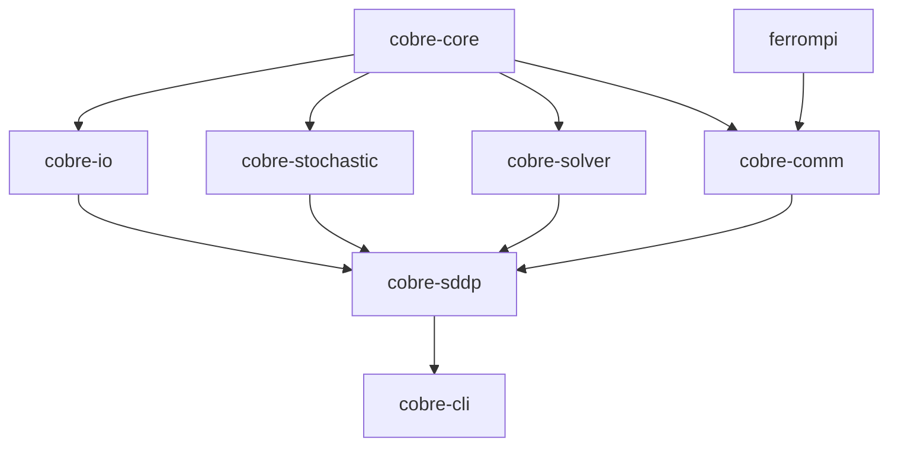

# Crate Overview

Cobre is organized as a Rust workspace with 11 crates. Each crate has a single responsibility and well-defined boundaries.

```
cobre/crates/
├── cobre-core/         Entity model (buses, hydros, thermals, lines)
├── cobre-io/           JSON/Parquet input, FlatBuffers/Parquet output
├── cobre-stochastic/   PAR(p) models, scenario generation
├── cobre-solver/       LP solver abstraction (HiGHS backend)
├── cobre-comm/         Communication abstraction (MPI, TCP, shm, local)
├── cobre-sddp/         SDDP training loop, simulation, cut management
├── cobre-cli/          Binary: run/validate/report/init/schema/summary/version
├── cobre-mcp/          Binary: MCP server for AI agent integration
├── cobre-python/       cdylib: PyO3 Python bindings
└── cobre-tui/          Library: ratatui terminal UI
```

## Dependency Graph

The diagram below shows the primary dependency relationships between workspace crates. Arrows point from dependency to dependent (i.e., an arrow from `cobre-core` to `cobre-io` means `cobre-io` depends on `cobre-core`).



For the full dependency graph and crate responsibilities, see the [methodology reference](https://cobre-rs.github.io/cobre-docs/specs/overview/implementation-ordering.html).

## Feature Summary

The ecosystem delivers a full SDDP training and simulation pipeline:

- **Entity model and topology validation** (`cobre-core`)
- **JSON/Parquet case loading** with 5-layer validation (`cobre-io`)
- **LP solver abstraction** with HiGHS backend and warm-start basis management (`cobre-solver`)
- **Pluggable communication** with MPI and local backends (`cobre-comm`)
- **PAR(p) inflow models** with deterministic correlated scenario generation and inflow non-negativity enforcement (`cobre-stochastic`)
- **SDDP training loop** with forward/backward passes, Benders cut generation, cut synchronization, and composite stopping rules (`cobre-sddp`)
- **Simulation pipeline** with Hive-partitioned Parquet output and FlatBuffers policy checkpointing (`cobre-sddp`)
- **CLI** with six subcommands (`run`, `validate`, `report`, `init`, `schema`, `summary`, `version`), rayon-based intra-rank thread parallelism, progress bars, and post-run summary (`cobre-cli`)
- **Python bindings** via PyO3 with Arrow zero-copy result loading (`cobre-python`)
- **JSON Schema** files for all input types, hosted for `$schema` editor integration

The workspace is verified by over 2,800 tests.
