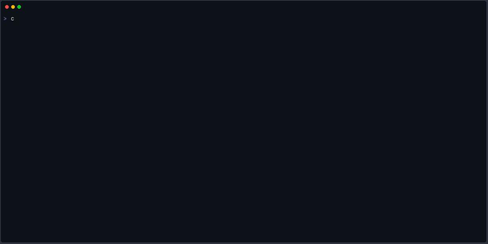

# CLI Reference

## Synopsis

```
cobre [--color <WHEN>] <SUBCOMMAND> [OPTIONS]
```

## Global Options

| Option           | Type                          | Default | Description                                                                                                                                                   |
| ---------------- | ----------------------------- | ------- | ------------------------------------------------------------------------------------------------------------------------------------------------------------- |
| `--color <WHEN>` | `auto` \| `always` \| `never` | `auto`  | Control ANSI color output on stderr. `always` forces color on — useful under `mpiexec` which pipes stderr through a non-TTY. Also honoured via `COBRE_COLOR`. |

## Subcommands

| Subcommand | Synopsis                         | Description                                                 |
| ---------- | -------------------------------- | ----------------------------------------------------------- |
| `run`      | `cobre run <CASE_DIR> [OPTIONS]` | Load, train, simulate, and write results                    |
| `validate` | `cobre validate <CASE_DIR>`      | Validate a case directory and print a diagnostic report     |
| `report`   | `cobre report <RESULTS_DIR>`     | Query results from a completed run and print JSON to stdout |
| `version`  | `cobre version`                  | Print version, solver backend, and build information        |

---

## `cobre run`

Executes the full solve lifecycle for a case directory:

1. **Load** — reads all input files and runs the 5-layer validation pipeline
2. **Train** — trains an SDDP policy using the configured stopping rules
3. **Simulate** — (optional) evaluates the trained policy over simulation scenarios
4. **Write** — writes all output files to the results directory

### Arguments

| Argument     | Type | Description                                                              |
| ------------ | ---- | ------------------------------------------------------------------------ |
| `<CASE_DIR>` | Path | Path to the case directory containing input data files and `config.json` |

### Options

| Option              | Type    | Default              | Description                                                                                                                                                            |
| ------------------- | ------- | -------------------- | ---------------------------------------------------------------------------------------------------------------------------------------------------------------------- |
| `--output <DIR>`    | Path    | `<CASE_DIR>/output/` | Output directory for results                                                                                                                                           |
| `--threads <N>`     | integer | `1`                  | Number of worker threads per MPI rank. Each thread solves its own LP instances; scenarios are distributed across threads. Resolves: `--threads` > `COBRE_THREADS` > 1. |
| `--skip-simulation` | flag    | off                  | Train only; skip the post-training simulation phase                                                                                                                    |
| `--quiet`           | flag    | off                  | Suppress the banner and progress bars. Errors still go to stderr                                                                                                       |
| `--no-banner`       | flag    | off                  | Suppress the startup banner but keep progress bars                                                                                                                     |
| `--verbose`         | flag    | off                  | Enable debug-level logging for `cobre_cli`; info-level for library crates                                                                                              |

### Examples

```bash
# Run a study with default output location
cobre run /data/cases/hydro_study

# Write results to a custom directory
cobre run /data/cases/hydro_study --output /data/results/run_001

# Train only, no simulation
cobre run /data/cases/hydro_study --skip-simulation

# Use 4 worker threads per MPI rank
cobre run /data/cases/hydro_study --threads 4

# Run without any terminal decorations (useful in scripts)
cobre run /data/cases/hydro_study --quiet

# Force color output when running under mpiexec
cobre --color always run /data/cases/hydro_study

# Enable verbose logging to diagnose solver issues
cobre run /data/cases/hydro_study --verbose
```

---

## `cobre validate`

Runs the 5-layer validation pipeline and prints a diagnostic report to stdout.

On success, prints entity counts:

```
Valid case: 3 buses, 12 hydros, 8 thermals, 4 lines
  buses: 3
  hydros: 12
  thermals: 8
  lines: 4
```

On failure, prints each error prefixed with `error:` and exits with code 1:



### Arguments

| Argument     | Type | Description                            |
| ------------ | ---- | -------------------------------------- |
| `<CASE_DIR>` | Path | Path to the case directory to validate |

### Options

None.

### Examples

```bash
# Validate a case directory before running
cobre validate /data/cases/hydro_study

# Use in a script: only proceed if validation passes
cobre validate /data/cases/hydro_study && cobre run /data/cases/hydro_study
```

---

## `cobre report`

Reads the JSON manifests written by `cobre run` and prints a JSON summary to stdout.

The output has the following top-level shape:

```json
{
  "output_directory": "/abs/path/to/results",
  "status": "complete",
  "training": { "iterations": {}, "convergence": {}, "cuts": {} },
  "simulation": { "scenarios": {} },
  "metadata": { "run_info": {}, "configuration_snapshot": {} }
}
```

`simulation` and `metadata` are `null` when the corresponding files are absent
(e.g., when `--skip-simulation` was used).

### Arguments

| Argument        | Type | Description                                           |
| --------------- | ---- | ----------------------------------------------------- |
| `<RESULTS_DIR>` | Path | Path to the results directory produced by `cobre run` |

### Options

None.

### Examples

```bash
# Print the full report to the terminal
cobre report /data/cases/hydro_study/output

# Extract the convergence gap using jq
cobre report /data/cases/hydro_study/output | jq '.training.convergence.final_gap_percent'

# Check the run status in a script
status=$(cobre report /data/cases/hydro_study/output | jq -r '.status')
if [ "$status" = "complete" ]; then
  echo "Training converged"
fi
```

---

## `cobre version`

Prints the binary version, active solver and communication backends, compression
support, host architecture, and build profile.

### Output Format

```
cobre   v0.1.0
solver: HiGHS
comm:   local
zstd:   enabled
arch:   x86_64-linux
build:  release (lto=thin)
```

| Line                               | Description                                                             |
| ---------------------------------- | ----------------------------------------------------------------------- |
| `cobre v{version}`                 | Binary version from `Cargo.toml`                                        |
| `solver: HiGHS`                    | Active LP solver backend (HiGHS in all standard builds)                 |
| `comm: local` or `comm: mpi`       | Communication backend (`mpi` only when compiled with the `mpi` feature) |
| `zstd: enabled`                    | Output compression support                                              |
| `arch: {arch}-{os}`                | Host CPU architecture and operating system                              |
| `build: release` or `build: debug` | Cargo build profile                                                     |

### Arguments

None.

### Options

None.

---

## Exit Codes

All subcommands follow the same exit code convention.

| Code | Category   | Cause                                                                                                                                                     |
| ---- | ---------- | --------------------------------------------------------------------------------------------------------------------------------------------------------- |
| `0`  | Success    | The command completed without errors                                                                                                                      |
| `1`  | Validation | Case directory failed the validation pipeline — schema errors, cross-reference errors, semantic constraint violations, or policy compatibility mismatches |
| `2`  | I/O        | File not found, permission denied, disk full, or write failure during loading or output                                                                   |
| `3`  | Solver     | LP infeasible subproblem or numerical solver failure during training or simulation                                                                        |
| `4`  | Internal   | Communication failure, unexpected channel closure, or other software/environment problem                                                                  |

Codes 1–2 indicate user-correctable input problems; codes 3–4 indicate case/environment
problems. Error messages are printed to stderr with `error:` prefix and hint lines.
See [Error Codes](../reference/error-codes.md) for a detailed catalog.

---

## Environment Variables

| Variable             | Description                                                                                                                                                                      |
| -------------------- | -------------------------------------------------------------------------------------------------------------------------------------------------------------------------------- |
| `COBRE_COMM_BACKEND` | Override the communication backend at runtime. Set to `local` to force the local backend even when the binary was compiled with `mpi` support.                                   |
| `COBRE_THREADS`      | Number of worker threads per MPI rank for `cobre run`. Overridden by the `--threads` flag. Must be a positive integer.                                                           |
| `COBRE_COLOR`        | Override color output when `--color auto` is in effect. Set to `always` or `never`. Ignored if `--color always` or `--color never` is given explicitly.                          |
| `FORCE_COLOR`        | Force color output on (any non-empty value). Checked after `COBRE_COLOR`. See [force-color.org](https://force-color.org).                                                        |
| `NO_COLOR`           | Disable colored terminal output. Respected by the banner and error formatters. Set to any non-empty value.                                                                       |
| `RUST_LOG`           | Control the tracing subscriber log level using standard `env_logger` syntax (e.g., `RUST_LOG=debug`, `RUST_LOG=cobre_sddp=trace`). Takes effect when `--verbose` is also passed. |
