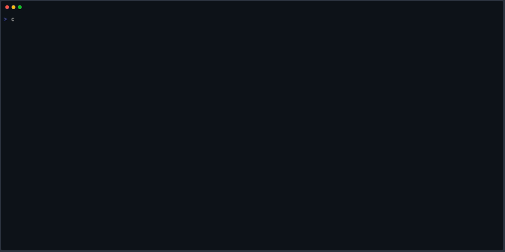

# Quickstart

This page takes you from zero to a completed SDDP study in three commands using the
built-in `1dtoy` template. The template models a single-bus hydrothermal system with
one hydro plant and two thermal units over a 4-stage finite planning horizon — small
enough to run in seconds, complete enough to demonstrate every stage of the workflow.

If you have not installed Cobre yet, start with [Installation](../guide/installation.md).



---

## Step 1: Scaffold a Case Directory

```bash
cobre init --template 1dtoy my_first_study
```

Cobre writes 10 input files into a new `my_first_study/` directory and prints a
summary to stderr:

```
 ━━━━━━━━━━━●
 ━━━━━━━━━━━●⚡  COBRE v0.3.2
 ━━━━━━━━━━━●   Power systems in Rust

Created my_first_study case directory from template '1dtoy':

  ✔ config.json                    Algorithm configuration: training (forward passes, stopping rules) and simulation settings
  ✔ initial_conditions.json        Initial reservoir storage volumes for each hydro plant at the start of the planning horizon
  ✔ penalties.json                 Global penalty costs for constraint violations (deficit, excess, spillage, storage bounds, etc.)
  ✔ stages.json                    Planning horizon definition: policy graph type, discount rate, stage dates, time blocks, and scenario counts
  ✔ system/buses.json              Electrical bus definitions with deficit cost segments
  ✔ system/hydros.json             Hydro plant definitions: reservoir bounds, outflow limits, turbine model, and generation limits
  ✔ system/lines.json              Transmission line definitions (empty in this single-bus example)
  ✔ system/thermals.json           Thermal plant definitions with piecewise cost segments and generation bounds
  ✔ scenarios/inflow_seasonal_stats.parquet  Seasonal PAR(p) statistics for hydro inflow scenario generation (mean, std, lag correlations)
  ✔ scenarios/load_seasonal_stats.parquet    Seasonal PAR(p) statistics for electrical load scenario generation (mean, std, lag correlations)

Next steps:
  -> cobre validate my_first_study
  -> cobre run my_first_study --output my_first_study/results
```

The directory structure is:

```
my_first_study/
  config.json
  initial_conditions.json
  penalties.json
  stages.json
  system/
    buses.json
    hydros.json
    lines.json
    thermals.json
  scenarios/
    inflow_seasonal_stats.parquet
    load_seasonal_stats.parquet
```

---

## Step 2: Validate the Case

```bash
cobre validate my_first_study
```

The validation pipeline checks all five layers — schema, references, physical
feasibility, stochastic consistency, and solver feasibility — and prints entity
counts on success:

```
Valid case: 1 buses, 1 hydros, 2 thermals, 0 lines
  buses: 1
  hydros: 1
  thermals: 2
  lines: 0
```

If any layer fails, Cobre prints each error prefixed with `error:` and exits with
code 1. The 1dtoy template always passes validation.

---

## Step 3: Run the Study

```bash
cobre run my_first_study --output my_first_study/results
```

Cobre runs the SDDP training loop (128 iterations, 1 forward pass each) followed by
a simulation pass (100 scenarios). Output is written to `my_first_study/results/`.
The banner, a progress bar, and a post-run summary are printed to stderr:

```
 ━━━━━━━━━━━●
 ━━━━━━━━━━━●⚡  COBRE v0.3.2
 ━━━━━━━━━━━●   Power systems in Rust

Training complete in 3.2s (128 iterations, converged at iter 94)
  Lower bound:  142.3 $/stage
  Upper bound:  143.1 +/- 1.2 $/stage
  Gap:          0.6%
  Cuts:         94 active / 94 generated
  LP solves:    512 (512 first-try, 0 retried, 0 failed)
  LP time:      1.2s total, 2.3ms avg
  Basis reuse:  100.0% hit (0 rejections / 510 offered)
  Simplex iter: 2048

Simulation complete (100 scenarios)
  Completed: 100  Failed: 0
  LP solves:    400 (400 first-try, 0 retried, 0 failed)
  LP time:      0.8s total, 2.0ms avg
  Simplex iter: 3200

Output written to my_first_study/results/
```

Exact numerical values (bounds, gap, cut counts, timing) will vary across runs
because scenario sampling is stochastic. The gap and iteration count depend on the
random seed and the convergence tolerance configured in `config.json`.

The results directory contains Hive-partitioned Parquet files for costs, hydro
dispatch, thermal dispatch, and bus balance, plus a FlatBuffers policy checkpoint:

```
my_first_study/results/
  policy/
    cuts/
      stage_000.bin  ...  stage_003.bin
    basis/
      stage_000.bin  ...  stage_003.bin
    metadata.json
  simulation/
    costs/
    hydros/
    thermals/
    buses/
```

---

## What's Next

You have completed a full SDDP study from case setup to results. The following pages
go deeper into how the case is structured and how to interpret the output:

- [Anatomy of a Case](./anatomy-of-a-case.md) — what each input file controls
- [Understanding Results](./understanding-results.md) — how to read Parquet output and convergence metrics
- [CLI Reference](../guide/cli-reference.md) — all flags, subcommands, and exit codes
- [Configuration](../guide/configuration.md) — every `config.json` field documented
